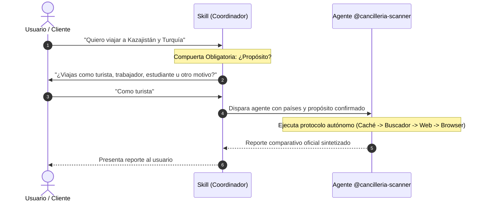

# Cancillería Country Policy Skill

This skill acts as the entrypoint and coordinator for traveler policy inquiries regarding the Ministry of Foreign Affairs of Colombia ([Cancillería](https://www.cancilleria.gov.co)).

To keep execution clean and token-efficient, this skill delegates the heavy lifting (web crawling, multi-tier escalation, and semantic parsing) to the dedicated [cancilleria-scanner](file:///Users/macbook/Documents/repos/agent-traveler/.agents/agents/cancilleria-scanner.md) agent.

---

## Workflow



---

## Step 1: Clarification Gate (Zero Assumptions)

When the user asks about traveling to one or more countries, check if the query includes the **traveler's purpose**:
- `tourist` (vacaciones, turismo, visitas cortas)
- `worker` (empleo formal, contratos laborales, prestación de servicios)
- `student` (estudios académicos, intercambios)
- `business` (negocios, inversiones)

> [!CRITICAL]
> If the travel purpose is **NOT** specified, **DO NOT TRIGGER THE AGENT YET**.
> Ask the user first:
> *"Para verificar las exigencias exactas de visa y permanencia en Cancillería, ¿viajarás como **turista**, **trabajador**, **estudiante** u otro motivo?"*

---

## Step 2: Trigger the `cancilleria-scanner` Agent

Once the purpose and country list are confirmed, launch the dedicated [cancilleria-scanner](file:///Users/macbook/Documents/repos/agent-traveler/.agents/agents/cancilleria-scanner.md) agent with the following parameters:

```text
Target Countries: <Lista de países, ej. "Kazajistán, Turquía, Unión Europea">
Travel Purpose: <tourist | worker | student | business>
Origin Nationality: Colombiana (pasaporte ordinario)
Agent Specification: .agents/agents/cancilleria-scanner.md
```

The agent will autonomously:
1. Attempt retrieval via deterministic live probing and filtered Cancillería search.
2. Escalate to external web search (`site:cancilleria.gov.co`) or `browser_subagent` if the country is unlisted or the portal layout changed.
3. Apply semantic reasoning to distinguish tourist short-stay rules from strict work visa requirements.

---

## Step 3: Present the Report

Deliver the final comparative Markdown report returned by the agent directly to the user.
