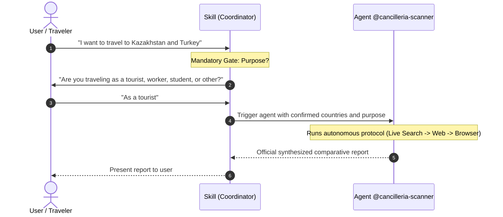

# Cancillería Country Policy Skill

This skill helps travelers find official travel advice and visa rules from Colombia's Ministry of Foreign Affairs ([Cancillería](https://www.cancilleria.gov.co)).

It works directly with the [cancilleria-scanner](../../agents/cancilleria-scanner.md) agent to check verified government requirements for each country on your itinerary.

---

## Workflow



---

## Step 1: Clarification Gate (Zero Assumptions)

When the user asks about traveling to one or more countries, check if the query includes the **traveler's purpose**:
- `tourist` (vacations, sightseeing, short visits)
- `worker` (formal employment, work contracts, professional services)
- `student` (academic studies, student exchanges)
- `business` (business meetings, investments)

> [!CRITICAL]
> If the travel purpose is **NOT** specified, **DO NOT TRIGGER THE AGENT YET**.
> Ask the user first:
> *"To verify official visa and stay requirements with Cancillería, will you be traveling as a **tourist**, **worker**, **student**, or other purpose?"*

---

## Step 2: Trigger the `cancilleria-scanner` Agent

Once the purpose and country list are confirmed, launch the dedicated [cancilleria-scanner](../../agents/cancilleria-scanner.md) agent with the following parameters:

```text
Target Countries: <List of countries, e.g. "Kazakhstan, Turkey, European Union">
Travel Purpose: <tourist | worker | student | business>
Origin Nationality: Colombian (ordinary passport)
Agent Specification: .agents/agents/cancilleria-scanner.md
```

The agent will autonomously:
1. Attempt retrieval via deterministic live probing and filtered Cancillería search.
2. Escalate to external web search (`site:cancilleria.gov.co`) or `browser_subagent` if the country is unlisted or the portal layout changed.
3. Apply semantic reasoning to distinguish tourist short-stay rules from strict work visa requirements.

---

## Step 3: Present the Report

Deliver the final comparative Markdown report returned by the agent directly to the user.
